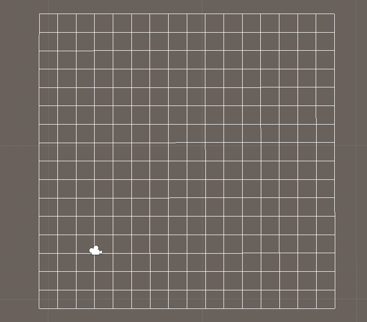
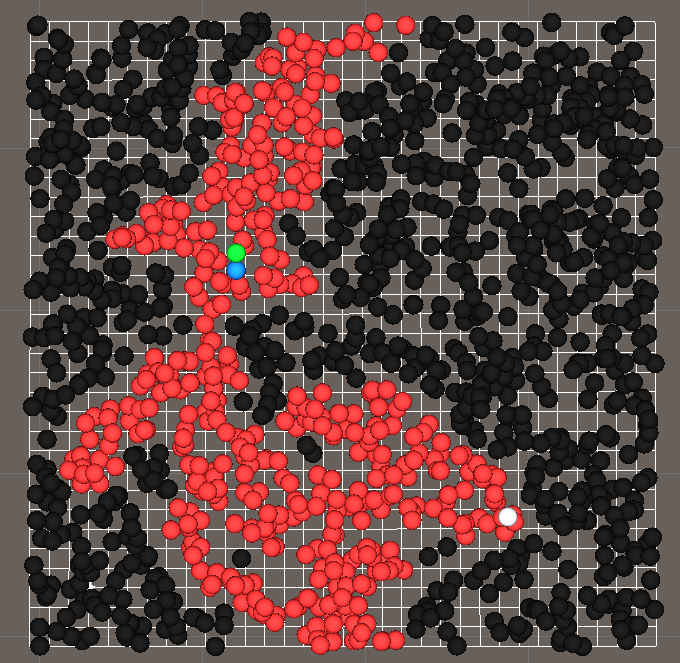
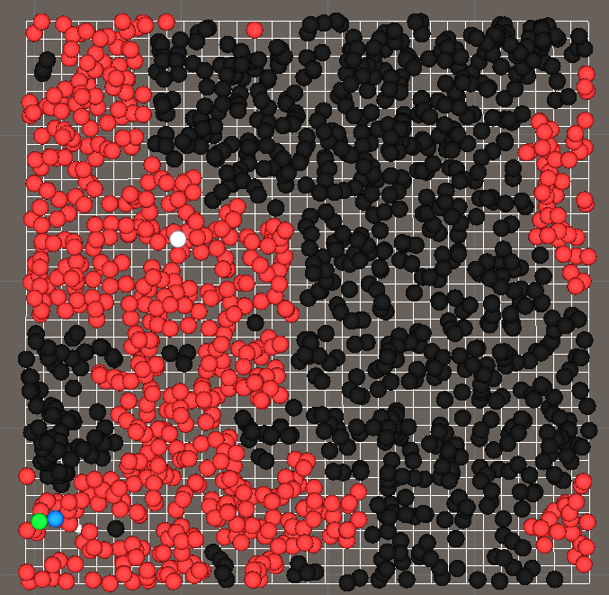
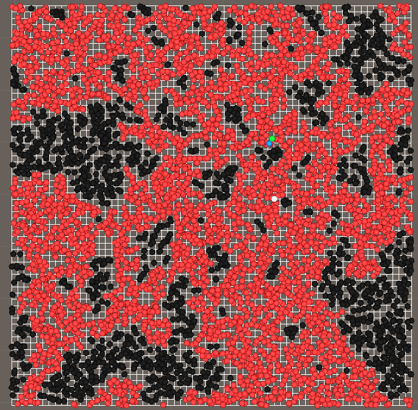
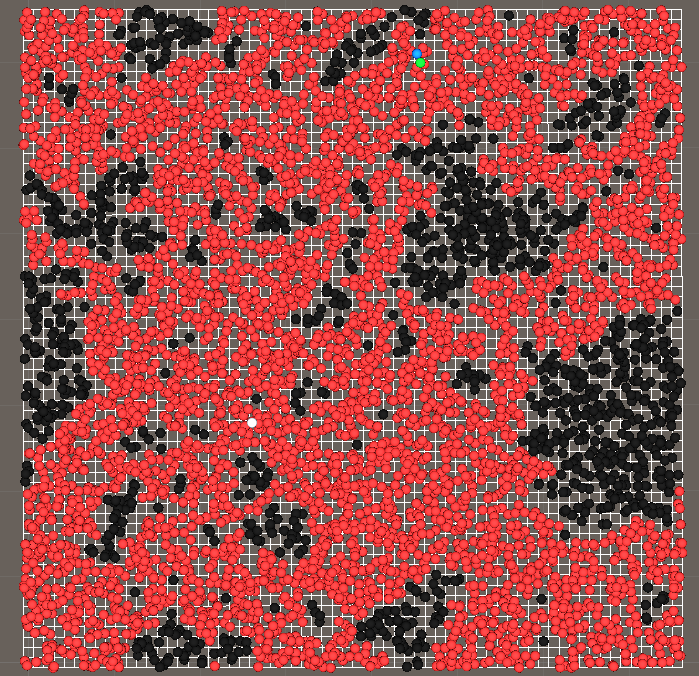

# What this is

Awesome project done in Unity!

This is essentially grid percolation taken a step further into contiuum percolation using Union find. This project was done to complete my Bachelor's thesis. It works for arbitrary sizes of the lattice.

This will only work in the Edit Mode. At the time as I was writing this, I figured it would be alot faster to debug in this way hence it remains in that state.

# Preview

## 16x16

## 32x32

## 64x64

# Credits

 
- The technique used to detect the wrapping cluster was taken from 

    [Continuum Percolation Thresholds in Two Dimensions by Stephan Mertens and Cristopher Moore](https://arxiv.org/abs/1209.4936)

- To debug this project and to show off these beautifull preview images I used

    [Visual Debugging by Sebastian Lague](https://github.com/SebLague/Visual-Debug)
